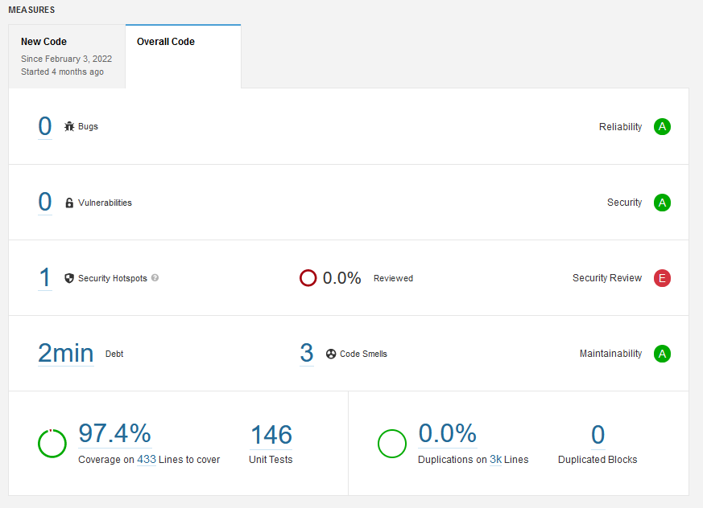
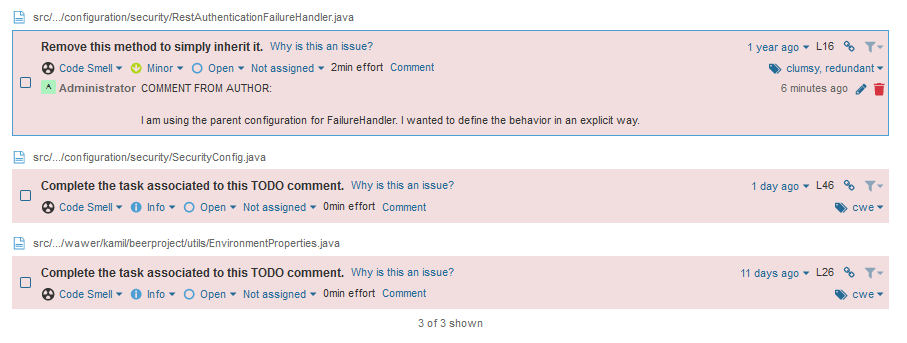

# Beer Application
## Table of contents
* [General info](#general-info)
* [Features](#features)
* [Current TODO list for FUNCTIONAL features](#current-todo-list-for-functional-features)
* [Current TODO list for TECHNICAL features](#current-todo-list-for-technical-features)
* [Technologies](#technologies)
* [Setup & Run](#setup-and-run)

## General info
This is project to manage and support participants during beer day fest!

## Features
Current technical features:
1. Ability to register new user
2. Sending emails to user, including emails with confirmation
3. Getting and managing breweries and beers
4. Getting and managing users existing within application and their privileges
5. User authentication via login endpoint
6. Implemented gathering logs mechanism
7. Implemented version control system for DB
8. Added dockerfile and docker-compose to run app.
9. Added code validator to measure code coverage and detects codesmells

The list of available endpoints is generated by swagger (*/swagger-ui/index.html)

## Current TODO list for FUNCTIONAL features
- Add external SMTP server
- Improve appearance of raw email messages
- Add reviews to the beer from external service

## Current TODO list for TECHNICAL features

- Refactor authentication system to use JWT instead of in-memory session
- Add CI/CD to improve release pipeline
- Investigate how to implement cache
- Add Integration Tests for CRUD operations
- Verify how to provide host address inside links within emails
- Others

## Technologies

List of used technologies and tools:
* Java 11
* Spring Boot
* Spring Data JPA
* Spring AOP
* Spring Security
* Spring Validation
* Spring Mail
* GreenMail (Embedded Email for Unit tests)
* Lombok
* Docker / Docker-Compose
* Liquibase
* Swagger
* SLF4J
* H2
* MySQL
* Mockito
* JUnit 5
* SonarQube

## Setup and Run

To run this application you need to first clone this repository. Then you can run this app in two ways:

#### DOCKER-COMPOSE (preferred solution)

Use docker-compose to run app. Make sure you have installed docker and docker-compose on you local environment. 
When you clone this repository you need to provide '.env' file with basic configuration. 
Reuse existing file '.env.template' and provide your values or leave it as default. Remember to remove '.template' from file name. If you need help, follow by additional instructions in the .env.template file.
Then, open terminal in project directory, and run command:

    docker-compose up

This will trigger creating containers with API (beerproject-api-1), MySQL database (beerproject-db-1) and developer mailbox(beerproject-email-1). DB contains some sample data. The app will be available at localhost:8081/api/v1/ (if you leave default port).

#### JAVA -JAR (TEST PROFILE)

You can also run this app with 'test' profile via classic java -jar command. This mode has embedded H2 database with sample data. 
Optionally, you can configure credentials to H2 DB. If you don't want to provide your custom values, skip this step.
In other case: the template of credentials and instruction, how to prepare config file, is placed in 'src/main/resources/credentials-xxx.yml.template'.
Follow the instructions inside. Please, be aware of in this case you need to provide test SMTP server to handle emails. It is highly recommended to use docker container with mailbox. You can use the following command:

    docker run -p 1080:1080 -p 1025:1025 maildev/maildev

After that, build package using maven tool. To build app use the following command:
    
    mvn package

Then, go to just generated 'target' directory and run app using command line:

    java -jar beer-project-1.0.jar --spring.profiles.active=test

The full list of endpoints you can see here(if you keep default config values): [http://localhost:8081/api/v1/swagger-ui/index.html](/localhost:8081/api/v1/swagger-ui/index.html)

## Current Status Of Project

The general code statistics of the application looks like as follows:

The list of current codesmells is looks like as follows:

Detected security hotspot vulnerability is due to way of logging to the service.
It will be enabled again when JWT will be implemented.
